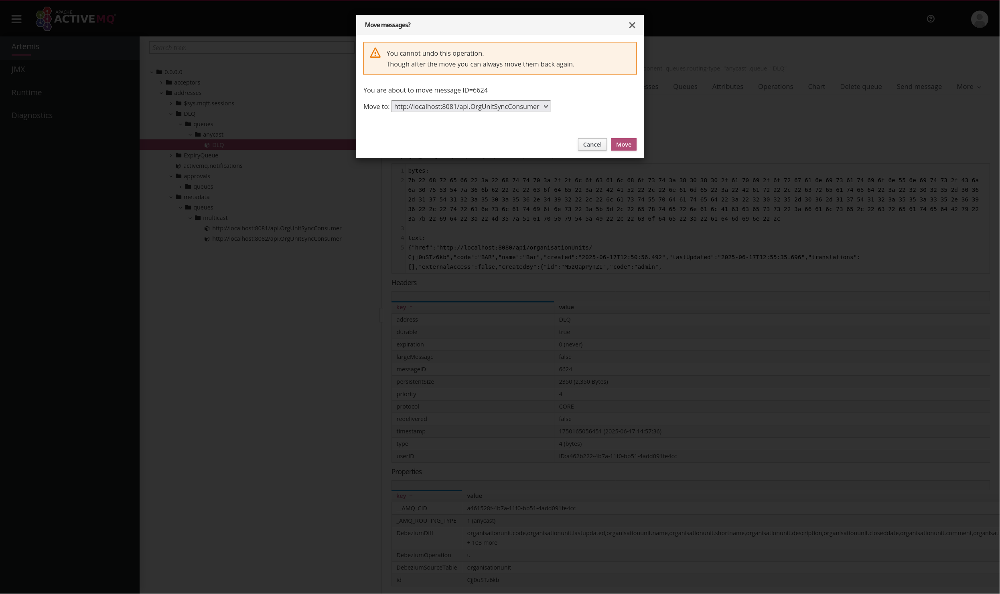

# Organisation Unit Synchronisation - reference implementation

1. [What is this implementation?](#what-is-this-implementation)
2. [Quick Start](#quick-start)
3. [Overview](#overview)
4. [Configuration](#configuration)
5. [Features](#features)
6. [Adaptation](#adaptation)

## What is this implementation?

A frequent requirement in an architecture with multiple DHIS2 instances is keeping the DHIS2 organisation units synchronised. Consider a DHIS2 server acting as a master facility registry. Such a server would typically need to have its organisation unit changes replicated to other servers. This reference implementation synchronises the organisation units of a primary DHIS2 server with one or more DHIS2 servers. In particular, it performs one-way synchronisation of the subsequent DHIS2 resources:

* Organisation units: creates, updates, and deletes
* Organisation unit groups: creates and updates
* Organisation unit group sets: creates and updates

This is an example which should be used for reference. It **SHOULD NOT** be used directly in production without adapting it to your local context.

## Quick Start

1. Enable logical replication in the source DHIS2 PostgreSQL database as shown in the [PostgreSQL documentation](https://www.postgresql.org/docs/current/logical-replication-config.html#LOGICAL-REPLICATION-CONFIG-PUBLISHER) to permit table changes to be replicated. At a minimum, the `wal_level` setting in the PostgreSQL configuration file (i.e., `postgresql.conf`) should be set to `logical`. Do not forget to restart the database following these changes.
2. Alter the `organisationunit` table in the source DHIS2 PostgreSQL database to capture the names of changed columns. The SQL statement for altering the table is: `ALTER TABLE organisationunit REPLICA IDENTITY FULL;`.
3. [Create a publication](https://www.postgresql.org/docs/current/sql-createpublication.html) called `dbz_publication` for the group of replicating tables in the source DHIS2 PostgreSQL database. The SQL for creating the publication is: `CREATE PUBLICATION dbz_publication FOR TABLE organisationunit, orgunitgroup, orgunitgroupset;`.
4. From the environment where you intend to run the reference implementation:
   1. [Install the Git client](https://git-scm.com/book/en/v2/Getting-Started-Installing-Git) and run the command shown next to download the reference implementation repository: `git clone https://github.com/dhis2/reference-org-unit-sync.git`
   2. [Install the application runner called JBang](https://www.jbang.dev/download/)
   3. Install the [Camel plugin for JBang](https://camel.apache.org/manual/camel-jbang.html#_installation)
   4. Edit `application.properties` as shown in the [instructions](#configuration). This file is located at the base path of the cloned `reference-org-unit-sync` directory
   5. From a terminal, change the current directory to `reference-org-unit-sync` and execute `camel run application.properties`
   6. Watch the app's standard output (e.g., terminal or log file) to confirm that no errors occurred during start-up
5. Open the maintenance app in the source DHIS2 server and add or update an organisation unit, an organisation group, or an organisation group set.
6. Allow a few seconds for the synchronisation with the target server/s to occur.
7. From the admin message inbox of the target DHIS2 server/s, you should see a new message notifying that a synchronisation happened.
8. Inspect the synchronised resource from the maintenance app of the target server/s.

### Monitoring & Management

To monitor and manage the org unit sync app, open a new terminal in the same environment where the app is running and enter: `camel hawtio OrgUnitSyncApp`. The command attaches a JVM agent to the app and opens the browser to render the [Hawtio web console](https://hawt.io/) on the address http://localhost:8888/hawtio/connect/remote:


If not already connected, connect the console to JVM agent which should direct your browser to http://localhost:8888/hawtio/camel/contexts:


## Overview

The following diagram conceptualises the architecture of this reference implementation:


What follows is a brief overview of the architectural components:

### Primary DHIS2 Server

The primary DHIS2 server is the source of truth (e.g., Master Facility Registry). The DHIS2 server administrator has to grant Web API read access to the org unit sync app for fetching the resources that will be synchronised. Furthermore, the DHIS2 database administrator has to grant the app appropriate access to the DHIS2 PostgreSQL database. From a security perspective, the administrator should create a database user for the app dedicated to replication:

```sql
CREATE USER orgunitsyncapp WITH REPLICATION PASSWORD 'xxxxxxxxxx';
```

Besides granting access to the org unit sync app, the database administrator is required to enable [logical replication](https://www.postgresql.org/docs/current/logical-replication.html) together with [full identity replication](https://www.postgresql.org/docs/current/sql-altertable.html#SQL-ALTERTABLE-REPLICA-IDENTITY) so that all DHIS2 organisation unit changes can be replicated. Moreover, the administrator has to [create a publication](https://www.postgresql.org/docs/current/sql-createpublication.html) named `dbz_publication` for the replicating tables which allows the org unit sync app to subscribe to row changes. This means that the following prerequisites need to be met in order to achieve the desired behaviour from the reference implementation:

1. The `wal_level` setting in the PostgreSQL configuration file (i.e., `postgresql.conf`) be set to `logical`.
2. The `REPLICA IDENTITY` for the `organisationunit` table is set to `FULL`.
3. A publication named `dbz_publication` is created for the replicating tables which are `orgainsiationunit`, `orgunitgroup`, and `orgunitgroupset`.

A record should be added to the [`pg_hba.conf`](https://www.postgresql.org/docs/current/auth-pg-hba-conf.html) file to restrict the replication user's access by IP address. Like this, one can further reduce the chances of unauthorised subscriptions to the `dbz_publication` publication. Here is a `pg_hba.conf` record illustrating access control:

```conf
host dhis2 orgunitsyncapp 10.7.22.18/32 md5
```

### Target DHIS2 Server

The target DHIS2 servers are the servers receiving synchronisation updates originating from the primary DHIS2 server. Each target server's DHIS2 administrator needs to grant Web API access to the org unit sync app. Such access should include permissions for deleting organisation units in addition to permissions for importing organisation units, organisation unit groups, and organisation unit sets.

### Org Unit Sync App

The org unit sync app is a low-code, customisable, event-driven reference solution built in [Apache Camel](https://camel.apache.org/) that runs from [JBang](https://www.jbang.dev/). It leverages the [logical replication](https://www.postgresql.org/docs/current/logical-replication.html) feature of PostgreSQL together with [identity replication](https://www.postgresql.org/docs/current/sql-altertable.html#SQL-ALTERTABLE-REPLICA-IDENTITY) to reliably capture DHIS2 organisation unit changes. Once logical replication is enabled and the required replica identity configured, the application can listen to row inserts, updates, and deletes that occur in a particular list of database tables. Tables can be removed or added from this list using the `source.tableIncludeList` parameter which is documented in the [configuration](#configuration) section. Nonetheless, the list is pre-configured with the following tables:

* `public.organisationunit`
* `public.orgunitgroup`
* `public.orgunitgroupset`

When the database publishes a change to one of the preceding tables, such as a row insert, the application captures the DHIS2 resource ID from the row before proceeding to fetch the new or updated DHIS2 resource by the aforementioned ID from the primary server via the DHIS2 Web API. The fetched resource is then, in case of a row insert or update, imported into the configured target DHIS2 servers. Alternatively, the resource is deleted from the configured target DHIS2 servers should the captured change be a row delete of an organisation unit.

The org unit sync app notifies the DHIS2 administrator of the target server when it synchronises a resource on the target. A message will appear in the administrator's inbox informing them the resource that was synchronised. The administrator will also be notified when a failure happens during synchronisation. 

### Broker

The reference broker in this implementation is an embedded [ActiveMQ Artemis](https://activemq.apache.org/) instance. Its role is to:

1. Decouple the producer publishing captured database changes from the consumer synchronising these changes. This gives the implementer flexibility to swap out the consumer of this reference implementation with their very own consumer. This custom consumer could, for example, synchronise the organisation units with non-DHIS2 target servers.

2. Reliably deliver captured DHIS2 resource changes. The broker delivers a captured change to the app within a transaction which prevents synchronisations from being lost due to unforeseen errors (e.g., power outage). The broker permanently removes the captured change from the persisted queue only when (1) the synchronisation has successfully completed, or (2) the synchronisation has failed and is moved to the [dead-letter queue](https://www.enterpriseintegrationpatterns.com/patterns/messaging/DeadLetterChannel.html).

It is strongly recommended to replace the embedded broker with a [standalone one](https://activemq.apache.org/components/artemis/documentation/latest/using-server.html#installation) for operational reasons (e.g., observability). Once you have a standalone broker running, you will need to set the org unit sync app parameter `camel.component.jms.connection-factory.brokerURL` to the standalone broker address.

## Configuration

The org unit sync application is configured through one or more properties files and/or command-line arguments. A template of the properties file is found in [`application.properties`](application.properties). The `application.properties` must be edited and tailored it to your needs before running the org unit sync app. At a minimum, you will need to specify the address details of the primary DHIS2 server and its database together with the address details of at least one target server as shown below:

```properties
source.dhis2DatabaseHostname=192.178.1.6
source.dhis2DatabasePort=5432
source.dhis2DatabaseUser=dhis
source.dhis2DatabasePassword=dhis
source.dhis2DatabaseDbName=dhis2

source.dhis2ApiUrl=https://play.im.dhis2.org/stable-2-41-3/api
source.dhis2ApiPersonalAccessToken=d2pat_x2UluDRx2W0KxmRxT6PnTebe1wjx5Eui3079960708

target.1.dhis2ApiUrl=https://play.im.dhis2.org/stable-2-40-7/api
target.1.dhis2ApiPersonalAccessToken=d2pat_NT03n0uZyjt9HsiYKNDA7KFHLqwy8CVE1103471171
```

While it is strongly recommended to authenticate with DHIS2 using the personal access token, you can choose to authenticate with the DHIS2 servers using HTTP basic access authentication as shown below:

```properties
source.dhis2DatabaseHostname=192.178.1.6
source.dhis2DatabasePort=5432
source.dhis2DatabaseUser=dhis
source.dhis2DatabasePassword=dhis
source.dhis2DatabaseDbName=dhis2

source.dhis2ApiUrl=https://play.im.dhis2.org/stable-2-41-3/api
source.dhis2ApiUsername=admin
source.dhis2ApiPassword=district

target.1.dhis2ApiUrl=https://play.im.dhis2.org/stable-2-40-7/api
target.1.dhis2ApiUsername=admin
target.1.dhis2ApiPassword=district
```

Additionally, you can mix the different DHIS2 server authentication schemes:

```properties
source.dhis2DatabaseHostname=192.178.1.6
source.dhis2DatabasePort=5432
source.dhis2DatabaseUser=dhis
source.dhis2DatabasePassword=dhis
source.dhis2DatabaseDbName=dhis2

source.dhis2ApiUrl=https://play.im.dhis2.org/stable-2-41-3/api
source.dhis2ApiPersonalAccessToken=d2pat_x2UluDRx2W0KxmRxT6PnTebe1wjx5Eui3079960708

target.1.dhis2ApiUrl=https://play.im.dhis2.org/stable-2-40-7/api
target.1.dhis2ApiUsername=admin
target.1.dhis2ApiPassword=district
```

You have the option to specify as many targets as you require but bear in mind that each target must have a corresponding distinct integer index in the parameter name:

```properties
source.dhis2DatabaseHostname=192.178.1.6
source.dhis2DatabasePort=5432
source.dhis2DatabaseUser=dhis
source.dhis2DatabasePassword=dhis
source.dhis2DatabaseDbName=dhis2

source.dhis2ApiUrl=https://play.im.dhis2.org/stable-2-41-3/api
source.dhis2ApiPersonalAccessToken=d2pat_x2UluDRx2W0KxmRxT6PnTebe1wjx5Eui3079960708

target.1.dhis2ApiUrl=https://play.im.dhis2.org/stable-2-40-7/api
target.1.dhis2ApiPersonalAccessToken=d2pat_NT03n0uZyjt9HsiYKNDA7KFHLqwy8CVE1103471171

target.2.dhis2ApiUrl=https://play.im.dhis2.org/stable-2-39-9/api
target.2.dhis2ApiUsername=admin
target.2.dhis2ApiPassword=district
```

The subsequent table lists the properties that can be configured in the org unit sync app:

|                **Parameter Name**                | **Description** |
|:------------------------------------------------:|:---------------:|
| camel.component.jms.connection-factory.brokerURL | TODO            |
|      camel.component.jms.connection-factory      | TODO            |
|            camel.jbang.classpathFiles            | TODO            |
|             camel.jbang.dependencies             | TODO            |
|          camel.jbang.platform-http.port          | TODO            |
|                camel.main.logMask                | TODO            |
|         camel.main.routesIncludePattern          | TODO            |
|         deadLetterChannel.deadLetterUri          | TODO            |
|      deadLetterChannel.maximumRedeliveries       | TODO            |
|        deadLetterChannel.redeliveryDelay         | TODO            |
|     deadLetterChannel.useExponentialBackOff      | TODO            |
|                     hostname                     | TODO            |
|                keyStore.password                 | TODO            |
|                  keyStore.path                   | TODO            |
|             source.dhis2ApiPassword              | TODO            |
|        source.dhis2ApiPersonalAccessToken        | TODO            |
|             source.dhis2ApiUsername              | TODO            |
|                source.dhis2ApiUrl                | TODO            |
|            source.dhis2DatabaseDbName            | TODO            |
|           source.dhis2DatabaseHostname           | TODO            |
|           source.dhis2DatabasePassword           | TODO            |
|             source.dhis2DatabasePort             | TODO            |
|             source.dhis2DatabaseUser             | TODO            |
|           source.offsetStorageFileName           | TODO            |
|             source.schemaIncludeList             | TODO            |
|               source.snapshotMode                | TODO            |
|             source.tableIncludeList              | TODO            |
|           target.[n].camelEndpointUri            | TODO            |
|           target.[n].dhis2ApiPassword            | TODO            |
|      target.[n].dhis2ApiPersonalAccessToken      | TODO            |
|           target.[n].dhis2ApiUsername            | TODO            |
|              target.[n].dhis2ApiUrl              | TODO            |
|         target.[n].fieldsRequireApproval         | TODO            |
|             target.[n].mapping.file              | TODO            |
|         target.[n].mapping.matchOnColumn         | TODO            |
|       target.[n].messageConversationUserId       | TODO            |
|               target.[n].idScheme                | TODO            |

## Features

### Synchronisation Approval

Besides automated synchronisation, synchronisation can be manually approved by a user of the target DHIS2. The `target.[n].fieldsRequireApproval` parameter allows you to specify the fields that must be approved before synchronisation is applied. Here is an example of the parameter set to a list of fields:

```properties
target.1.fieldsRequireApproval=organisationunit.code,organisationunit.shortname
```

From the example, you can observe that each field must be prefixed with the table name. When a field listed in `target.[n].fieldsRequireApproval` changes in the source DHIS2 server, the app will:

1. Create an entry of the draft metadata import in the DHIS2 target data store within the `org-unit-sync` namespace.
2. Open a ticket in the DHIS2 target containing a review link and an approval link. The review link points to the draft metadata import which the ticket assignee can view and edit. The approval link points to the org unit sync app itself, and once clicked, kicks off the synchronisation of the resource.

### Full synchronisation

By default, the org unit sync app replicates resource changes starting from its last known position in the source database's write-ahead log. If the app does not know or lost its last position, then it will replicate only new changes. The latter scenario usually happens when the app is starting up for the very first time or the app's `offset.dat` file is removed. Overall, this behaviour translates to the app NOT replicating table changes that occurred prior to its first start-up. However, the default behaviour can be overridden. 

Setting the `source.snapshotMode` parameter to `initial` will force the app to replicate all changes in the table's history before starting to stream new changes. In `initial` mode, the app will only perform the full synchronisation when it is loading up for the very first time. The app will not perform full synchronisations in subsequent start-ups because it will have recorded its position in the database write-ahead log. Deleting the `offset.dat` file will reset the app's position to the beginning of the write-ahead log. The offset file resides within `data` directory of the app but can be stored elsewhere thanks to the `source.offsetStorageFileName` parameter. Note that setting the `source.offsetStorageFileName` parameter to any value different from `data/offset.dat` effectively means having the org unit sync app lose its position within the write-ahead log. You will need to copy the existing `offset.dat` to its new location in order to keep the app's write-ahead log position. 

### Synchronisation replay

A synchronisation fails when the app could not complete the operation in three attempts. A backoff multiplier increases the time between each attempt. After exhausting the allowed no. of retries, the app gives up and stores the failed synchronisation within the [broker](#broker)'s dead-letter queue named `DLQ`. Note that a failed synchronisation for a given target server will NOT cause the entire synchronisation process to abort. The application will jump to the next target server should it fail to synchronise the current target server.

From the [Artemis management console](https://activemq.apache.org/components/artemis/documentation/latest/management-console.html), the system operator can view the `DLQ` queue to inspect the resource IDs together with metadata of failed synchronisations:


The error causing the synchronisation to fail can be analysed from the log file of the org unit sync app. To replay a failed synchronisation, while on the management console page, select the failed message from the `DLQ` queue and move it to the `delta/sync/1` queue: 



If synchronisation fails again because the error persists or a different error occurs, then the newly failed synchronisation is pushed to the dead-letter queue.

On a standalone ActiveMQ Artemis broker, the management console is typically available on port _8161_. By default, however, the management console is unavailable because the app runs an embedded Artemis instance. It is strongly recommended to replace the embedded broker with a standalone one for operational purposes (e.g., observability). Once you have a standalone broker running, you will need to set the org unit sync app parameter `camel.component.jms.connection-factory.brokerURL` to the standalone broker address.

### Mapping

Some use cases necessitate that fields are not synchronised. For instance, the implementer might want to keep the organisation unit name unchanged in the target DHIS2 server so that it remains in the local language. In such cases, the implementer should create a comma-delimited CSV with headers defining the mappings and reference it from the `target.[n].mapping.file` app parameter as shown below:

```properties
target.1.mapping.file=target1/mappings.csv
```

Note: you can have multiple targets using the same mapping file. Here is an example of a mapping file:

```csv
name,code,shortName
Kailahun,Kaylahun,Kaylahun
Port Loko,PatLoko,Pat Loko
```

The preceding CSV maps resources that have their `name` field equal to `Kailahun` or `Port Loko` A resource originating from the source DHIS2 server with the name `Kailahun` will have its fields mapped according to the columns in the first row prior to being imported into the target server. Similarly, a resource matching the name `Port Loko` will also have its fields transformed to the column values of the second row.

The org unit sync app uses the first column of the CSV mapping to select the resources that will be mapped. This behaviour can be overridden by setting the `target.[n].mapping.matchOnColumn` to a different CSV column. For instance, using the previous CSV example, setting `target.[n].mapping.matchOnColumn` to `shortName` will configure tha app to map resources that have their `shortName` equal to `Kaylahun` or `Pat Loko`.

## Adaptation

The organisation unit sync reference implementation should be adapted to fit your local needs. A good understanding of [Apache Camel](https://camel.apache.org/) is a prerequisite to customising the application. The [DHIS2 developer documentation](https://developers.dhis2.org/docs/integration/apache-camel) provides a gentle introduction to Apache Camel. What follows are typical places where one would want to customise in their implementation:

### Non-DHIS2 target

Despite the org unit sync app being geared towards synchronising DHIS2 targets, the app can be adapted to support non-DHIS2 servers. This adaptation would require the implementer to author one or more Camel route that synchronise the new target type. Some points to consider when implementing new target types:

* The [`camel/dhis2target.camel.yaml` file](camel/capture.camel.yaml)) should serve as a guide for authoring the custom Camel routes synchronising the non-DHIS2 target. 
* It is important to elect one of the new custom routes to be an entry point for synchronisation updates. The elected route should have a `from` [`direct` endpoint](https://camel.apache.org/components/next/direct-component.html) URI. This URI should then be referenced from the `target.[n].camelEndpointUri` app parameter so that the elected route receives the synchronisation updates.
* Files containing Camel routes should have the extension `.camel.yaml` and be located in the `camel` directory.
* User-defined parameters prefixed with `target.[n].` are accessible from Camel variables. For instance, a user-defined parameter such as `target.1.myProperty` can be accessed from a route with the [Simple expression](https://camel.apache.org/components/next/languages/simple-language.html): `${variables.target['myProperty']}`.

### Approval workflow

Adapting the current approval workflow means changing the [`camel/approve.camel.yaml` file](camel/approve.camel.yaml). The reference implementation piggies back on DHIS2's data store and ticketing system to implement the approval workflow but it is more than likely that you would need to change the `dhis2` Camel endpoints in `approve.camel.yaml` such that they point to your own systems for storing draft metadata imports and creating tickets.

### Synchronised resources

Follow the subsequent steps for synchronising new resources like DHIS2 users: 

1. Specify the list of tables to capture changes in the `source.tableIncludeList` app parameter as shown below:

   ```properties
   source.tableIncludeList=public.user,public.organisationunit
   ```

2. Drop any existing database publication named `dbz_publication` and create a new one for the replicating tables. Here is statement creating a publication for the `user` and `organisationunit` tables.

   ```sql
   CREATE PUBLICATION dbz_publication FOR TABLE user, organisationunit;
   ```

3. If deletes are to be synchronised or synchronisations might require approval, then the replica identity of the relevant tables need to be set to full. For instance: `ALTER TABLE user REPLICA IDENTITY FULL`.

4. Author a Camel route in a new YAML file that fetches the changed resource from the source DHIS2 Web API and then proceeds to transform the fetched resource into a metadata import payload. It is suggested that the [`camel/orgUnitSync.camel.yaml` file](camel/orgUnitSync.camel.yaml) is used as an example for authoring the route. However, note that a filter for dropping delete operations should be used at the beginning of your route if you do not want to support delete synchronisations.

5. The entry point route receiving the captured change must have a [`direct`](https://camel.apache.org/components/next/direct-component.html) [`from`](https://camel.apache.org/components/next/eips/from-eip.html) endpoint where the name matches the source table that the route is targeting. In other words, if the route should capture changes from the `user` table, then the `from` endpoint URI needs to be set to `direct:user`.

### Dead-letter queue

TODO