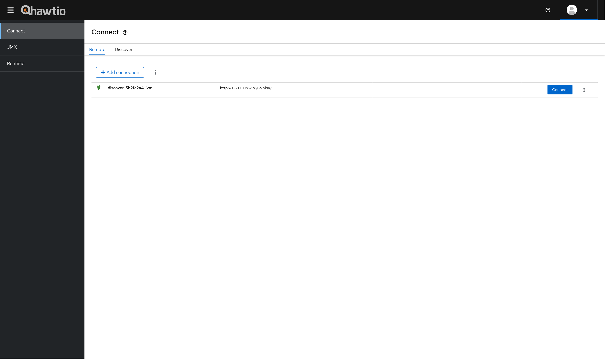
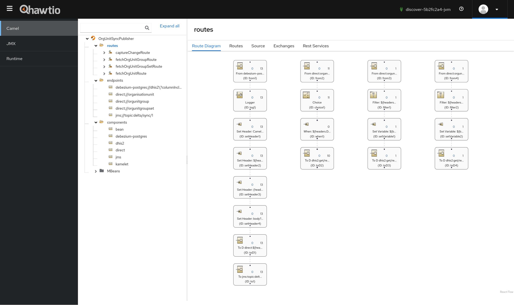
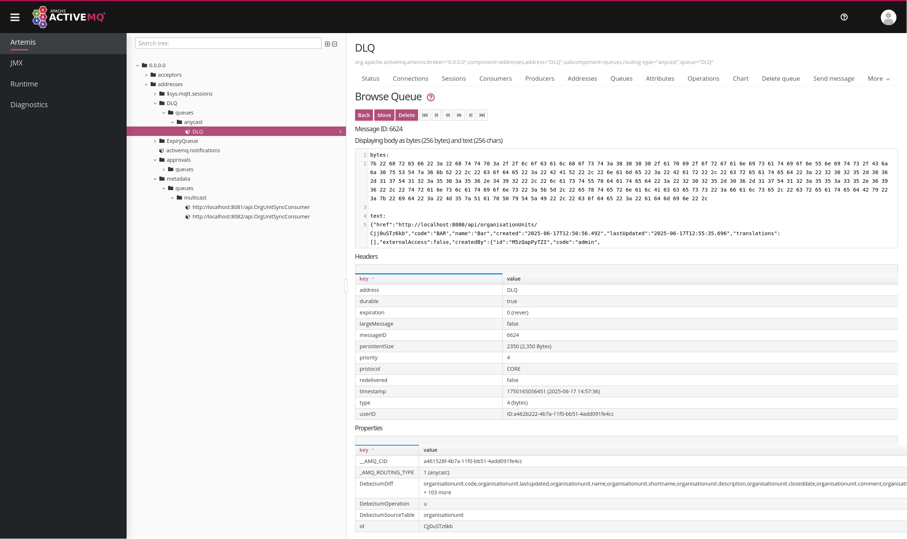

# Organisation Unit Synchronisation - reference implementation

1. [What is this implementation?](#what-is-this-implementation)
2. [Quick Start](#quick-start)
3. [Overview](#overview)
4. [Publisher Configuration](#publisher-configuration)
5. [Consumer Configuration](#consumer-configuration)
6. [Features](#features)
7. [Adaptation](#adaptation)
8. [Support](#support)

## What is this implementation?

A frequent requirement in an architecture with multiple DHIS2 instances is keeping the DHIS2 organisation units synchronised. Consider a DHIS2 server acting as a master facility registry. Such a server would typically need to have its organisation unit changes replicated to other servers. This reference, event-driven implementation reliably synchronises the organisation units of a primary DHIS2 server with one or more DHIS2 servers. In particular, it performs one-way synchronisation of the subsequent DHIS2 resources:

* Organisation units: creates, updates, and deletes
* Organisation unit groups: creates and updates
* Organisation unit group sets: creates and updates

This is an example meant to guide you in developing your own organisation unit synchronisation solution. It **SHOULD NOT** be used directly in production without adapting it to your local context.

## Quick Start

1. Enable logical replication in the source DHIS2 PostgreSQL database as shown in the [PostgreSQL documentation](https://www.postgresql.org/docs/current/logical-replication-config.html#LOGICAL-REPLICATION-CONFIG-PUBLISHER) to permit table changes to be replicated. At a minimum, the `wal_level` setting in the PostgreSQL configuration file (i.e., `postgresql.conf`) should be set to `logical`. Restart the database following these changes.
2. Alter the `organisationunit` table in the source DHIS2 PostgreSQL database to capture the names of changed columns. The SQL statement for altering the table is: `ALTER TABLE organisationunit REPLICA IDENTITY FULL;`.
3. [Create a publication](https://www.postgresql.org/docs/current/sql-createpublication.html) called `dbz_publication` for the group of replicating tables in the source DHIS2 PostgreSQL database. The SQL for creating the publication is: `CREATE PUBLICATION dbz_publication FOR TABLE organisationunit, orgunitgroup, orgunitgroupset;`.
4. From the environment where you intend to run the reference implementation:
   1. [Install the Git client](https://git-scm.com/book/en/v2/Getting-Started-Installing-Git) and run the command shown next to download the reference implementation repository: `git clone https://github.com/dhis2/reference-org-unit-sync.git`
   2. [Install the application runner called JBang](https://www.jbang.dev/download/)
   3. Install the [Camel plugin for JBang](https://camel.apache.org/manual/camel-jbang.html#_installation)
5. Run the publisher app:
   1. Edit `application.properties` as shown in the [instructions](#publisher-configuration). This file is located in the `publisher` directory within the cloned `reference-org-unit-sync` repository
   2. From a terminal, change the current directory to `reference-org-unit-sync/publisher` and execute `camel run application.properties`
   3. Watch the app's standard output (e.g., terminal or log file) to confirm that no errors occurred during start-up
6. Run the consumer app:
   1. Edit `application.properties` as shown in the [instructions](#consumer-configuration). This file is located in the `consumer` directory within the cloned `reference-org-unit-sync` repository
   2. From a terminal, change the current directory to `reference-org-unit-sync/consumer` and execute `camel run application.properties`
   3. Watch the app's standard output (e.g., terminal or log file) to confirm that no errors occurred during start-up
7. Open the maintenance app in the source DHIS2 server and add or update an organisation unit, an organisation group, or an organisation group set.
8. Allow a few seconds for the synchronisation with the target server/s to occur.
9. From the admin message inbox of the target DHIS2 server/s, you should see a new message notifying that a synchronisation happened.
10. Inspect the synchronised resource from the maintenance app of the target server/s.

### Monitoring & Management

To monitor and manage the publisher or the consumer, open a new terminal in the same environment where the app is running and enter `camel hawtio OrgUnitSyncPublisher` to monitor the publisher or `camel hawtio OrgUnitSyncConsumer` to monitor the consumer. The command attaches a JVM agent to the app and opens the browser to render the [Hawtio web console](https://hawt.io/) on the address http://localhost:8888/hawtio/connect/remote:



If not already connected, connect the console to the app's JVM agent which should direct your browser to http://localhost:8888/hawtio/camel/contexts:



## Overview

The following diagram conceptualises the architecture of this reference implementation:


What follows is a brief overview of the architectural components:

### Primary DHIS2 Server

The primary DHIS2 server is the source of truth (e.g., Master Facility Registry). The DHIS2 administrator has to grant Web API read access to the publisher app for fetching the resources that will be synchronised. Furthermore, the administrator of the DHIS2 database has to grant the app appropriate access to the DHIS2 PostgreSQL database. From a security perspective, the administrator should create a database user for the app dedicated to replication:

```sql
CREATE USER orgunitsyncapp WITH REPLICATION PASSWORD 'xxxxxxxxxx';
```

Besides granting access to the publisher, the database administrator is required to enable [logical replication](https://www.postgresql.org/docs/current/logical-replication.html) together with [full identity replication](https://www.postgresql.org/docs/current/sql-altertable.html#SQL-ALTERTABLE-REPLICA-IDENTITY) so that all DHIS2 organisation unit changes can be replicated. Moreover, the administrator has to [create a publication](https://www.postgresql.org/docs/current/sql-createpublication.html) named `dbz_publication` for the replicating tables which allows the app to subscribe to row changes. This means that the following prerequisites need to be met in order to achieve the desired behaviour from the reference implementation:

1. The `wal_level` setting in the PostgreSQL configuration file (i.e., `postgresql.conf`) be set to `logical`.
2. The `REPLICA IDENTITY` for the `organisationunit` table is set to `FULL`.
3. A publication named `dbz_publication` is created for the replicating tables which are `orgainsiationunit`, `orgunitgroup`, and `orgunitgroupset`.

A record ought to be added to the [`pg_hba.conf`](https://www.postgresql.org/docs/current/auth-pg-hba-conf.html) file to restrict the replication user's access by IP address. Like this, one can further reduce the chances of unauthorised subscriptions to the `dbz_publication` publication. Here is a `pg_hba.conf` record illustrating access control:

```conf
host dhis2 orgunitsyncapp 10.7.22.18/32 md5
```

### Target DHIS2 Server

The target DHIS2 servers are the servers receiving synchronisation updates originating from the primary DHIS2 server. Each of the target server's DHIS2 administrator needs to grant Web API access to the consumer app. The DHIS2 user representing the consumer app in the target server should have the following metadata authorities: 

   * Add/Update organisation unit
   * Delete organisation unit
   * Add/Update organisation unit group
   * Add/Update organisation unit group set

### Publisher

The publisher is a low-code, customisable, event-driven reference solution built in [Apache Camel](https://camel.apache.org/) that runs from [JBang](https://www.jbang.dev/). It leverages the [logical replication](https://www.postgresql.org/docs/current/logical-replication.html) feature of PostgreSQL together with [identity replication](https://www.postgresql.org/docs/current/sql-altertable.html#SQL-ALTERTABLE-REPLICA-IDENTITY) to reliably capture DHIS2 organisation unit changes. Once logical replication is enabled and the required replica identity configured, the application can listen to row inserts, updates, and deletes that occur in a particular list of database tables. Tables can be removed or added from this list using the `tableIncludeList` parameter which is documented in the [configuration](#publisher-configuration) section. Nonetheless, the list is pre-configured with the following tables:

* `public.organisationunit`
* `public.orgunitgroup`
* `public.orgunitgroupset`

When the database publishes a change for one of the preceding tables, such as a row insert, the application captures the DHIS2 resource ID from the row before proceeding to fetch the new or updated DHIS2 resource by the aforementioned ID from the primary server via the DHIS2 Web API. The fetched resource is then published to a multicast persistent queue on the broker.

### Consumer

The consumer is a low-code, customisable, event-driven reference solution built in [Apache Camel](https://camel.apache.org/) that runs from [JBang](https://www.jbang.dev/). It creates a [durable subscriber](https://www.enterpriseintegrationpatterns.com/patterns/messaging/DurableSubscription.html) for each configured target DHIS2 server to synchronise the metadata resources published from the org unit sync publisher app. When a subscriber consumes a metadata resource, in case of a row insert or update, it imports the resource into a target DHIS2 server. Alternatively, the subscriber deletes the resource from the target DHIS2 server should the captured change be a row delete of an organisation unit.

The consumer notifies the DHIS2 administrator of the target server when it synchronises a resource on the target. A message will appear in the administrator's inbox informing them the resource that was synchronised. The administrator will also be notified when a failure happens during synchronisation.

For simplicity, this reference implementation consists of a single consumer, however, there is no reason why the consumer cannot be broken down into smaller, more dedicated consumers. For instance, you might deploy a separate consumer process for each target DHIS2 server as opposed to one consumer that synchronises all target servers. This approach helps contain the impact if a consumer is ever compromised. Your use case and security requirements will drive the number and type of consumers. 

### Broker

The reference broker in this implementation is an embedded [ActiveMQ Artemis](https://activemq.apache.org/) instance. Its role is to:

1. Decouple the producer publishing captured database changes from the consumer/s synchronising these changes. This gives the implementer flexibility to add their own consumers. A custom consumer could, for example, synchronise the organisation units with non-DHIS2 target servers.

2. Reliably deliver captured DHIS2 resource changes. The broker delivers a captured change to the consumer from a durable multicast queue which prevents loss of synchronisations due to unforeseen errors (e.g., power outage). The broker permanently removes the captured change from the queue only when (1) the synchronisation has successfully completed, or (2) the synchronisation has failed and is moved to the [dead-letter queue](https://www.enterpriseintegrationpatterns.com/patterns/messaging/DeadLetterChannel.html).

It is strongly recommended to replace the embedded broker with a [standalone one](https://activemq.apache.org/components/artemis/documentation/latest/using-server.html#installation) for operational  (e.g., observability) and security reasons. Once you have a standalone broker running, you will need to set both the publisher and consumers app parameters `camel.component.jms.connection-factory.brokerURL` to the standalone broker address.

## Publisher Configuration

The publisher is configured through one or more properties files and/or command-line arguments. A template of the properties file is found in [`publisher/application.properties`](publisher/application.properties). The `application.properties` must be edited and tailored to your needs before running the publisher app. At a minimum, you will need to specify both the web and database address details of the primary DHIS2 server:

```properties
dhis2DatabaseHostname=192.178.1.6
dhis2DatabasePort=5432
dhis2DatabaseUser=dhis
dhis2DatabasePassword=dhis
dhis2DatabaseDbName=dhis2

dhis2ApiUrl=https://play.im.dhis2.org/stable-2-41-3/api
dhis2ApiPersonalAccessToken=d2pat_x2UluDRx2W0KxmRxT6PnTebe1wjx5Eui3079960708
```

While it is strongly recommended to authenticate with DHIS2 using the [personal access token](https://docs.dhis2.org/en/develop/using-the-api/dhis-core-version-master/introduction.html#webapi_pat_authentication), you can choose to authenticate with the primary DHIS2 server using [HTTP basic access authentication](https://docs.dhis2.org/en/develop/using-the-api/dhis-core-version-master/introduction.html#webapi_basic_authentication) as shown below:

```properties
dhis2DatabaseHostname=192.178.1.6
dhis2DatabasePort=5432
dhis2DatabaseUser=dhis
dhis2DatabasePassword=dhis
dhis2DatabaseDbName=dhis2

dhis2ApiUrl=https://play.im.dhis2.org/stable-2-41-3/api
dhis2ApiUsername=admin
dhis2ApiPassword=district
```

The subsequent table lists the parameters that can be configured in the publisher:

|                **Parameter Name**                | **Description**                                                                                                                                                                                                                                                                                                                                                              |
|:------------------------------------------------:|------------------------------------------------------------------------------------------------------------------------------------------------------------------------------------------------------------------------------------------------------------------------------------------------------------------------------------------------------------------------------|
| camel.component.jms.connection-factory.brokerURL | Address for connecting to the broker                                                                                                                                                                                                                                                                                                                                         |
|      camel.component.jms.connection-factory      | Reference to a connection factory Java class used for establishing connections to the broker                                                                                                                                                                                                                                                                                 |
|            camel.jbang.camel-version             | Specifies the Camel runtime version                                                                                                                                                                                                                                                                                                                                          |
|            camel.jbang.classpathFiles            | Comma-separated list of files to include in the Java classpath                                                                                                                                                                                                                                                                                                               |
|             camel.jbang.dependencies             | Comma-separated list of Maven coordinates to third-party Java packages to include with the application                                                                                                                                                                                                                                                                       |
|                camel.main.logMask                | Whether masking of sensitive data in logs is enabled                                                                                                                                                                                                                                                                                                                         |
|                 camel.main.name                  | Sets the name of the application                                                                                                                                                                                                                                                                                                                                             |
|         camel.main.routesIncludePattern          | Java source files and Camel routes to load to include with the application                                                                                                                                                                                                                                                                                                   |
|                 dhis2ApiPassword                 | Password of the Web API user in the source DHIS2 server. Required when not using PAT authentication                                                                                                                                                                                                                                                                          |
|           dhis2ApiPersonalAccessToken            | PAT of the Web API user in the source DHIS2 server. Required when not using basic access authentication                                                                                                                                                                                                                                                                      |
|                 dhis2ApiUsername                 | Username of the Web API user in the source DHIS2 server. Required when not using PAT authentication                                                                                                                                                                                                                                                                          |
|                   dhis2ApiUrl                    | Web API base path of the source DHIS2 server (required)                                                                                                                                                                                                                                                                                                                      |
|               dhis2DatabaseDbName                | Database name of the source DHIS2 database (required)                                                                                                                                                                                                                                                                                                                        |
|              dhis2DatabaseHostname               | Database hostname of the source DHIS2 server from where to replicate metadata resources (required)                                                                                                                                                                                                                                                                           |
|              dhis2DatabasePassword               | Password of the source DHIS2 database user (required)                                                                                                                                                                                                                                                                                                                        |
|                dhis2DatabasePort                 | Database port no. of the source DHIS2 server (required)                                                                                                                                                                                                                                                                                                                      |
|                dhis2DatabaseUser                 | Username of the source DHIS2 database user (required)                                                                                                                                                                                                                                                                                                                        |
|     logging.level.[fullyQualifiedClassName]      | Logging verbosity set for a particular Java class. Available levels: `TRACE`, `DEBUG`, `INFO`, `WARN`, `ERROR`, and `WARN`                                                                                                                                                                                                                                                   |
|              offsetStorageFileName               | Path to file where table offsets are to be recorded so that the publisher knows from where to resume in the database's write-ahead log. Defaults to `data/offset.dat`                                                                                                                                                                                                        |
|            publicationAutocreateMode             | Specifies whether and how the application creates a PostgreSQL publication. Visit the [Debezium documentation](https://debezium.io/documentation/reference/stable/connectors/postgresql.html#postgresql-publication-autocreate-mode) to view the full set of options. Defaults to `disabled` for security reasons.                                                           |
|                 publicationName                  | Name of the PostgreSQL publication to stream changes from. Defaults to `dbz_publication`                                                                                                                                                                                                                                                                                     |
|                schemaIncludeList                 | Database schemas for which events should be captured. Defaults to `public`                                                                                                                                                                                                                                                                                                   |
|                     slotName                     | Name of the PostgreSQL logical decoding slot that was created for streaming changes from a particular plug-in for a particular database/schema. Defaults to `slot1`                                                                                                                                                                                                          |
|                   snapshotMode                   | Whether to snapshot tables. Visit the [Debezium documentation](https://debezium.io/documentation/reference/stable/connectors/postgresql.html#postgresql-property-snapshot-mode) to view the full set of options. Defaults to `no_data` for performance reasons. Read the [Full synchronisation](#full-synchronisation) section for further information about table snapshots |
|                 tableIncludeList                 | Tables for which changes are to be captured. Defaults to `public.organisationunit,public.orgunitgroup,public.orgunitgroupset`                                                                                                                                                                                                                                                |


## Consumer Configuration

The consumer is configured through one or more properties files and/or command-line arguments. A template of the properties file is found in [`consumer/application.properties`](consumer/application.properties). The `application.properties` must be edited and tailored to your needs before running the consumer app. At a minimum, you will need to specify the address details of at least one target server as shown below:

```properties
target.1.dhis2ApiUrl=https://play.im.dhis2.org/stable-2-40-7/api
target.1.dhis2ApiPersonalAccessToken=d2pat_NT03n0uZyjt9HsiYKNDA7KFHLqwy8CVE1103471171
```

You have the option to specify as many targets as you require but bear in mind that each target must have a corresponding distinct integer index in the parameter name:

```properties
target.1.dhis2ApiUrl=https://play.im.dhis2.org/stable-2-40-7/api
target.1.dhis2ApiPersonalAccessToken=d2pat_NT03n0uZyjt9HsiYKNDA7KFHLqwy8CVE1103471171

target.2.dhis2ApiUrl=https://play.im.dhis2.org/stable-2-39-9/api
target.2.dhis2ApiPersonalAccessToken=d2p_RaTpxk2iqPJ2rpCic32DGyBbN5CTuawCNHKtiWZTzSEf2YFx9B
```

While it is strongly recommended to authenticate with DHIS2 using the [personal access token](https://docs.dhis2.org/en/develop/using-the-api/dhis-core-version-master/introduction.html#webapi_pat_authentication), you can choose to authenticate with the DHIS2 servers using [HTTP basic access authentication](https://docs.dhis2.org/en/develop/using-the-api/dhis-core-version-master/introduction.html#webapi_basic_authentication) as shown below:

```properties
target.1.dhis2ApiUrl=https://play.im.dhis2.org/stable-2-40-7/api
target.1.dhis2ApiUsername=admin
target.1.dhis2ApiPassword=district
```

Additionally, you can mix the different DHIS2 server authentication schemes:

```properties
target.1.dhis2ApiUrl=https://play.im.dhis2.org/stable-2-40-7/api
target.1.dhis2ApiPersonalAccessToken=d2pat_NT03n0uZyjt9HsiYKNDA7KFHLqwy8CVE1103471171

target.2.dhis2ApiUrl=https://play.im.dhis2.org/stable-2-39-9/api
target.2.dhis2ApiUsername=admin
target.2.dhis2ApiPassword=district
```

The subsequent table lists the parameters that can be configured in the consumer:

|                **Parameter Name**                | **Description**                                                                                                                                                                                                                                                                              |
|:------------------------------------------------:|:---------------------------------------------------------------------------------------------------------------------------------------------------------------------------------------------------------------------------------------------------------------------------------------------|
|                   approve.url                    | Base URL used in approval links sent to the target. If unset, the app will attempt to resolve the base URL itself                                                                                                                                                                            |
| camel.component.jms.connection-factory.brokerURL | Address for connecting to the broker                                                                                                                                                                                                                                                         |
|      camel.component.jms.connection-factory      | Reference to a connection factory Java class used for establishing connections to the broker                                                                                                                                                                                                 |
|            camel.jbang.camel-version             | Specifies the Camel runtime version                                                                                                                                                                                                                                                          |
|            camel.jbang.classpathFiles            | Comma-separated list of files to include in the Java classpath                                                                                                                                                                                                                               |
|             camel.jbang.dependencies             | Comma-separated list of Maven coordinates to third-party Java packages to include with the application                                                                                                                                                                                       |
|               camel.server.enabled               | Whether to start the embedded HTTP server for listening to approval messages                                                                                                                                                                                                                 |
|                camel.server.port                 | Port to use for binding the embedded HTTP server                                                                                                                                                                                                                                             |
|                camel.main.logMask                | Whether masking of sensitive data in logs is enabled                                                                                                                                                                                                                                         |
|                 camel.main.name                  | Sets the name of the application                                                                                                                                                                                                                                                             |
|         camel.main.routesIncludePattern          | Java source files and Camel routes to load to include with the application                                                                                                                                                                                                                   |
|         deadLetterChannel.deadLetterUri          | Address for sending failed synchronisations to. Defaults to `jms:queue:DLQ`                                                                                                                                                                                                                  |
|      deadLetterChannel.maximumRedeliveries       | Maximum number of attempts to synchronise a target. Defaults to 3                                                                                                                                                                                                                            |
|        deadLetterChannel.redeliveryDelay         | Delay between synchronisations attempts of target. Defaults to 1000 milliseconds                                                                                                                                                                                                             |
|     deadLetterChannel.useExponentialBackOff      | Whether to increase the time between each attempt. Defaults to true                                                                                                                                                                                                                          |
|                keyStore.password                 | Password to the keystore referenced from the `keyStore.path` parameter                                                                                                                                                                                                                       |
|                  keyStore.path                   | Path to the keystore containing the AES key for encrypting query params in the approval link                                                                                                                                                                                                 |
|     logging.level.[fullyQualifiedClassName]      | Logging verbosity set for a particular Java class. Available levels: `TRACE`, `DEBUG`, `INFO`, `WARN`, `ERROR`, and `WARN`                                                                                                                                                                   |
|           target.[n].allowedOperations           | Comma-delimited list of allowed synchronisation operations. Supported operations are `c` (create), `u` (updated), `d` (delete), and `r` (read, applicable for full synchronisation).  Defaults to `c,u,d`                                                                                    |
|        target.[n].camelDirectEndpointName        | Endpoint of Camel route that transmits the metadata to the target server. Defaults to `dhis2Target`                                                                                                                                                                                          |
|           target.[n].dhis2ApiPassword            | Password of the Web API user in the target DHIS2 server. Required when not using PAT authentication                                                                                                                                                                                          |
|      target.[n].dhis2ApiPersonalAccessToken      | PAT of the Web API user in the target DHIS2 server. Required when not using basic access authentication                                                                                                                                                                                      |
|           target.[n].dhis2ApiUsername            | Username of the Web API user in the target DHIS2 server. Required when not using PAT authentication                                                                                                                                                                                          |
|              target.[n].dhis2ApiUrl              | Web API base path of the target DHIS2 server (required)                                                                                                                                                                                                                                      |
|         target.[n].fieldsRequireApproval         | Comma-delimited list of row columns that require approval when changed. Read the [Synchronisation Approval](#synchronisation-approval) section for further information about this parameter. Defaults to an empty list                                                                       |
|           target.[n].resourceMap.file            | Path to a CSV file that defines the mappings to the resource in the target server. Read the [Metadata Resource Mapping](#metadata-resource-mapping) section for further information about further information about this parameter                                                           |
|       target.[n].messageConversationUserId       | DHIS2 User ID of the message recipient in the target DHIS2 server. This DHIS2 user is notified when a synchronisation was successful or failed. Defaults to the admin user ID `M5zQapPyTZI`                                                                                                  |
|               target.[n].idScheme                | Identifier scheme to use when importing the metadata into the target DHIS2 server. Visit the [DHIS2 documentation](https://docs.dhis2.org/en/develop/using-the-api/dhis-core-version-master/metadata.html#webapi_identifier_schemes) to view available identifier schemes. Defaults to `uid` |

## Features

### Synchronisation Approval

Besides automated synchronisation, synchronisation can be manually approved by a user of the target DHIS2. The `target.[n].fieldsRequireApproval` parameter in the consumer app allows you to specify which updated row columns in source server must be approved before synchronisation is applied. Here is an example of the parameter set to a list of fields:

```properties
target.1.fieldsRequireApproval=organisationunit.code,organisationunit.shortname
```

From the example, you can observe that each field must be prefixed with the table name. When a field listed in `target.[n].fieldsRequireApproval` changes in the source DHIS2 server, the app will:

1. Create an entry of the draft metadata import in the DHIS2 target data store within the `org-unit-sync` namespace.
2. Open a ticket in the DHIS2 target containing a review link and an approval link. The review link points to the draft metadata import which the ticket assignee can view and edit. The approval link points to the consumer app itself, and once clicked, kicks off the synchronisation operation. After successful synchronisation, the consumer deletes the draft metadata import entry in the data store. 

>IMPORTANT: the consumer will request approvals for synchronisations as long as there are entries in the `org-unit-sync` data store namespace. This prevents unapproved fields from being synchronised. 

### Full synchronisation

#### Publisher

By default, the publisher app replicates resource changes starting from its last known position in the source database's write-ahead log. If the app does not know or lost its last position, then it will replicate only new changes. The latter scenario usually happens when the app is starting up for the very first time or the app's `offset.dat` file is removed. Overall, this behaviour translates to the app NOT replicating table changes that occurred prior to its first start-up. However, the default behaviour can be overridden. 

Setting the `snapshotMode` publisher app parameter to `initial` will force the publisher to replicate all changes in the table's history before starting to stream new changes. The `inital` snapshot mode will only succeed when the publisher's database user has select rights on the tables specified in the `tableIncludeList` parameter. By default, `tableIncludeList` is set to `public.organisationunit,public.orgunitgroup,public.orgunitgroupset`. Assuming the publisher's database user is named `orgunitsyncapp`, the SQL for granting the necessary permissions would be: 

```sql
GRANT SELECT ON public.organisationunit,public.orgunitgroup,public.orgunitgroupset TO orgunitsyncapp
```

In `initial` mode, the publisher performs the full synchronisation when it is loading up for the very first time. The publisher will not perform full synchronisations in subsequent start-ups because it will have recorded its position in the database write-ahead log. Deleting the `offset.dat` file will reset the publisher's position to the beginning of the write-ahead log. The offset file resides within `data` directory of the publisher but can be stored elsewhere thanks to the `offsetStorageFileName` parameter. Note that setting the `offsetStorageFileName` parameter to any value different from `data/offset.dat` effectively means having the publisher app lose its position within the write-ahead log. You will need to copy the existing `offset.dat` to its new location in order to keep the app's write-ahead log position. 

#### Consumer

Apart from setting `snapshotMode` parameter to `initial` in the producer app, for full synchronisation to occur, the consumer reference app also needs to be configured such that it synchronises past resource changes in addition to later new ones. The configuration is applied on a per-target basis with the `target.[n].allowedOperations` parameter which allows you to fully synchronise selected target servers. Such granularity is of particularly benefit when replicating large tables since one would want to avoid the overhead of synchronising target servers that are already in-sync with the source server. 

A target server has `target.[n].allowedOperations` preset to `c,u,d` in the consumer configuration in order to permit create, update, and delete synchronisations. To fully synchronise a target server, the server's corresponding `target.[n].allowedOperations` parameter needs to be set to `c,u,d,r`. This allows read operations to be synchronised. In the following properties file, the consumer is configured to synchronise two DHIS2 servers:

```properties
target.1.dhis2ApiUrl=https://play.im.dhis2.org/stable-2-40-7/api
target.1.dhis2ApiPersonalAccessToken=d2pat_NT03n0uZyjt9HsiYKNDA7KFHLqwy8CVE1103471171

target.2.dhis2ApiUrl=https://play.im.dhis2.org/stable-2-39-9/api
target.2.dhis2ApiPersonalAccessToken=d2p_RaTpxk2iqPJ2rpCic32DGyBbN5CTuawCNHKtiWZTzSEf2YFx9B
target.2.allowedOperations=c,u,d,r
```

By default, the app synchronises the first DHIS2 server only with new changes. On the hand, the second DHIS2 server is kept in-sync with new and old changes thanks to `target.2.allowedOperations=c,u,d,r`.

### Synchronisation replay

A synchronisation fails when the consumer app could not complete the operation in three attempts. A backoff multiplier increases the time between each attempt. After exhausting the allowed number of retries, the app gives up and stores the failed synchronisation within the [broker](#broker)'s dead-letter queue named `DLQ`. Note that a failed synchronisation for a given target server will NOT cause the entire synchronisation process to abort. The application will jump to the next target server should it fail to synchronise the current target server.

From the [Artemis management console](https://activemq.apache.org/components/artemis/documentation/latest/management-console.html), the system operator can view the `DLQ` queue to inspect the resource IDs together with metadata of failed synchronisations:



The error causing the synchronisation to fail can be analysed from the log file of the consumer app. To replay a failed synchronisation, while on the management console page, select the failed message from the `DLQ` queue and move it to the multicast queue delivering synchronisations to the target server: 


If synchronisation fails again because the error persists or a different error occurs, then the newly failed synchronisation is pushed to the dead-letter queue.

On a standalone ActiveMQ Artemis broker, the management console is typically available on port _8161_. By default, however, the management console is unavailable because the publisher runs an embedded Artemis instance. It is strongly recommended to replace the embedded broker with a standalone one for operational (e.g., observability) and security reasons. Once you have a standalone broker running, you will need to set both the producer and consumer app parameters `camel.component.jms.connection-factory.brokerURL` to the standalone broker address.

### Metadata Resource Mapping

It is entirely possible that the metadata resources in the target DHIS2 implementations to synchronise are completely out of sync from the source DHIS2 server. Without matching metadata identifiers like the `name` or `id`, it becomes impossible for a metadata sync solution to locate the target metadata resource to synchronise. For such scenarios, the implementer should author a metadata resource map and then reference it from the `target.[n].resourceMap.file` consumer app parameter. 

A resource map is a comma-delimited CSV with headers that defines mappings for target metadata resources. The CSV needs to have one column prefixed with `source_` denoting the source metadata identifier that a mapping will match on. All other columns in the CSV denote the fields that the source metadata resource will be mapped to.

By way of illustration, consider the following resource map referenced from the consumer:

```properties
target.1.resourceMap.file=target1/resourceMap.csv
```

Note: you can have multiple targets using the same mapping file. `resourceMap.csv` is shown to be like this:

```csv
source_name,name,shortName,code
1St Omo Shera Health Post,Adegna Omo Shera Health Post,Adegna Omo,AdegnaOmo
Aba Biya Primary Clinic,Aba Biya Midium Clinic,Aba Biya,AbaBiya
```

The preceding CSV maps the source organisation unit having the name "1St Omo Shera Health Post" to one having the name "Adegna Omo Shera Health Post", the short name "Adegna Omo", and the code "AdegnaOmo". Similarly, the source organisation unit having the name "Aba Biya Primary Clinic" is mapped to an organisation unit having the name "Aba Biya Midium Clinic", the short name "Aba Biya", and the code "AbaBiya".

## Adaptation

The organisation unit sync reference implementation should be adapted to fit your local needs. A good understanding of [Apache Camel](https://camel.apache.org/) is a prerequisite to customising the application. The [DHIS2 developer documentation](https://developers.dhis2.org/docs/integration/apache-camel) provides a gentle introduction to Apache Camel. What follows are typical places where one would want to customise in their implementation:

### Non-DHIS2 target

Despite the reference consumer being geared towards synchronising DHIS2 targets, the app can be adapted to support non-DHIS2 servers. This adaptation would require the implementer to author one or more Camel route that synchronise the new target type. Some points to consider when implementing new target types:

* The [`consumer/camel/dhis2Target.camel.yaml` file](consumer/camel/dhis2Target.camel.yaml)) should serve as a guide for authoring the custom Camel routes synchronising the non-DHIS2 target. 
* It is important to elect one of the new custom routes to be an entry point for synchronisation updates. The elected route should have a `from` [`direct` endpoint](https://camel.apache.org/components/next/direct-component.html) URI. This endpoint name should then be referenced from the `target.[n].camelDirectEndpointName` consumer app parameter so that the elected route receives the synchronisation updates.
* Files containing Camel routes should have the extension `.camel.yaml` and be located in the `camel` directory.
* User-defined parameters prefixed with `target.[n].` are accessible from Camel variables. For instance, a user-defined parameter such as `target.1.myProperty` can be accessed from a route with the [Simple expression](https://camel.apache.org/components/next/languages/simple-language.html): `${variables.target['myProperty']}`.

### Approval workflow

Adapting the current approval workflow means changing the [`consumer/camel/approve.camel.yaml` file](consumer/camel/approve.camel.yaml). The reference implementation piggies back on DHIS2's data store and ticketing system to implement the approval workflow but it is more likely that you would need to change the `dhis2` Camel endpoints in the `consumer/camel/approve.camel.yaml` file such that they open tickets and save draft metadata imports in your bespoke solutions. Besides replacing the `dhis2` Camel endpoints, the `steps` within `approve.camel.yaml` might need to be modified to fit your approval workflow. Read the route and step descriptions within `approve.camel.yaml` to understand how the current workflow is orchestrated.

### Synchronised resources

Follow the subsequent steps for synchronising new resources like DHIS2 users: 

1. Specify the list of tables to capture changes in the `tableIncludeList` publisher app parameter as shown below:

   ```properties
   tableIncludeList=public.user,public.organisationunit
   ```

2. Drop any existing database publication named `dbz_publication` and create a new one for the replicating tables. Here is statement creating a publication for the `user` and `organisationunit` tables.

   ```sql
   CREATE PUBLICATION dbz_publication FOR TABLE user, organisationunit;
   ```

3. If deletes are to be synchronised or synchronisations might require approval, then the replica identity of the relevant tables need to be set to full. For instance: `ALTER TABLE user REPLICA IDENTITY FULL`.

4. Author a Camel route in the [`publisher/camel/capture.camel.yaml`](publisher/camel/capture.camel.yaml) config for fetching the changed resource from the source DHIS2 Web API. The route must have a [`direct`](https://camel.apache.org/components/next/direct-component.html) [`from`](https://camel.apache.org/components/next/eips/from-eip.html) endpoint where the endpoint name matches the source table that the route is targeting. In other words, if the route should capture changes from the `user` table, then the `from` endpoint URI needs to be set to `direct:user`. Note that a filter for dropping delete operations should be used at the beginning of your route if you do not want to support delete synchronisations.

5. Author another Camel route in a new YAML config within the `consumer` directory that transforms the fetched resource into a metadata import payload. It is suggested that the [`consumer/camel/orgUnitSync.camel.yaml` file](consumer/camel/orgUnitSync.camel.yaml) is used as an example for authoring the route.

### Running E2E Tests

This project ships with automated end-to-end (E2E) tests written in [Playwright](https://playwright.dev/) to verify the implementation's functionality. These tests should be run, and even extended, following adaptation. The subsequent prerequisites need to be installed before running the tests:

* [Docker Compose](https://docs.docker.com/compose/install/): platform for running DHIS2 and database containers
* [Yarn](https://classic.yarnpkg.com/lang/en/docs/install/#debian-stable): package manager for installing the test runner
* [Playwright](https://playwright.dev/docs/intro#installing-playwright): end-to-end test runner

To execute the tests, from a terminal:

1. Change to the root directory of the reference org unit sync project
2. Run `docker compose -f tests/compose.yaml up --wait` to stand up the DHIS2 and database Docker containers
3. Run `yarn playwright test` to execute the test suite

# Support

Questions or feedback about this reference implementation can be posted on the [DHIS2 Community of Practice](https://community.dhis2.org/). Contributions in the form of [pull requests](https://github.com/dhis2/reference-org-unit-sync/pulls) are more than welcome.
